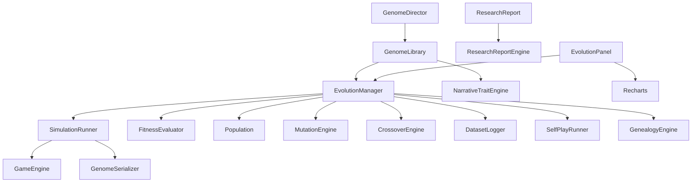

# Offline Evolution Framework — Extended Architecture

## 1. Updated Architecture Diagram

```text
┌────────────────────────────────────────────────────────────────────────────────┐
│                          OFFLINE EVOLUTION FRAMEWORK                            │
│                      (runs in build / CI / dev tooling / browser panel)         │
└────────────────────────────────────────────────────────────────────────────────┘
          │                         │                          │
          ▼                         ▼                          ▼
   ┌──────────────┐      ┌──────────────────┐        ┌─────────────────┐
   │   Genome     │      │  Player Agent    │        │   GameEngine    │
   │  (AI params) │      │   Benchmark      │        │   (untouched)   │
   │ + genealogy  │      │     Suite        │        │                 │
   └──────┬───────┘      └────────┬─────────┘        └────────┬────────┘
          │                       │                           │
          │         ┌─────────────┘                           │
          │         │                                         │
          ▼         ▼                                         ▼
┌────────────────────────────────────────────────────────────────────────────────┐
│                           SimulationRunner                                      │
│  • deterministic seeded PRNG  • fast round transitions  • per-round telemetry   │
└────────────────────────────────────────────────────────────────────────────────┘
          │
          ▼
┌────────────────────────────────────────────────────────────────────────────────┐
│                           FitnessEvaluator                                      │
│  Multi-objective player-experience fitness with configurable weights            │
│  Win · Survival · Damage · Forced Adaptation · Combat Variety · Duration        │
│  Behaviour Diversity · Combo Diversity · Spacing Diversity · Unpredictability   │
│  Close Finish Bonus · Camping · Infinite Block/Aggression · Repeated Move       │
└────────────────────────────────────────────────────────────────────────────────┘
          │
          ▼
┌────────────────────────────────────────────────────────────────────────────────┐
│                           EvolutionManager                                      │
│  Selection · Elitism · Crossover · Mutation · Random restart · Early stopping   │
│  Genealogy tracking · Dataset logging · Optional self-play bonus                │
└────────────────────────────────────────────────────────────────────────────────┘
          │
          ├──► EvolutionReport  ──► ChampionGenome.json / EvolutionReport.json
          ├──► ResearchReport   ──► ResearchReport.json
          ├──► DatasetLogger    ──► Dataset.jsonl (LLM fine-tuning)
          ├──► GenomeLibrary    ──► champions/*.json
          └──► GenomeDirector   ──► selectGenome(intent, profile, stage)
```

## 2. Module Dependency Graph



## 3. Multi-objective Fitness Equation

```text
score =
    w_winRate            * winScore
  + w_survival           * genomeHpFrac
  + w_damage             * (genomeDamageDealt / playerMaxHp)
  + w_forcedAdaptation   * forcedAdaptationScore
  + w_combatVariety      * (attackVariety + spacingVariety) / 2
  + w_fightDuration      * durationScore
  + w_behaviourDiversity * behaviourDiversityScore
  + w_comboDiversity     * comboDiversityScore
  + w_spacingDiversity   * spacingDiversityScore
  + w_unpredictability   * (1 - repeatedMoveRatio)
  + w_closeFinishBonus   * (1 - |genomeHpFrac - playerHpFrac|)
  - w_campingPenalty     * campingPenalty
  - w_infiniteBlockPenalty     * infiniteBlockPenalty
  - w_infiniteAggressionPenalty * infiniteAggressionPenalty
  - w_repeatedMovePenalty      * repeatedMoveRatio
  - w_timeoutPenalty           * timeoutPenalty
```

All weights are configured through a single `IFitnessWeights` object. Every metric is normalized to `[0, 1]`.

## 4. Genome Schema

| Field | Type | Description |
|-------|------|-------------|
| `id` | string | Unique genome id |
| `version` | string | Genome schema version |
| `generation` | number | Birth generation |
| `source` | string | Provenance |
| `parentA` | string? | Parent A id |
| `parentB` | string? | Parent B id |
| `fitnessHistory` | number[] | Per-evaluation fitness trace |
| `narrativeTraits` | INarrativeTrait[] | Generated narrative descriptors |
| `aggression` | number | Attack tendency |
| `blockChance` | number | Block/dodge probability |
| `reaction` | number | Reaction delay (s) |
| `combo` | number | Max combo length |
| `whiffPunish` | number | Whiff punish chance |
| `antiAir` | number | Anti-air chance |
| `pressure` | number | Pressure tendency |
| `mixup` | number | Mixup tendency |
| `adaptive` | number | Adaptation strength |
| `rage` | number | Rage boost |
| `perfection` | number | Perfect block chance |
| `readDelay` | number? | Read delay |

## 5. Genealogy Schema

`ILineageNode`
```typescript
{
  generation: number;
  genomeId: string;
  parentIds: string[];
  source: string;
  fitness: number;
  fitnessHistory?: number[];
}
```

`IGenealogyNode` extends `ILineageNode` with `children: IGenealogyNode[]` and `depth: number`, forming a tree.

## 6. Dataset Schema

`IDatasetSample` (JSONL line)
```typescript
{
  id: string;
  timestamp: string;
  generation: number;
  context: { archetypeId, baseOpponent, roundsToWin, seed };
  genome: IGenome;
  archetype: string;
  decision: { style, primaryStrategy, riskLevel };
  result: { genomeWon, rounds, hp fractions, duration, timeout };
  fitness: number;
  objectiveScores: Record<string, number>;
  metrics: { hits, damage, combos, block time, spacing, attack kinds };
  outcome: "win" | "loss" | "draw" | "timeout";
}
```

## 7. Director Integration Flow

```text
Director intent
      │
      ▼
┌─────────────────┐
│ GenomeDirector  │ selectGenome(intent, playerProfile, campaignStage)
└────────┬────────┘
         │
         ▼
┌─────────────────┐
│  GenomeLibrary  │ choose best ILibraryEntry
└────────┬────────┘
         │
         ▼
┌─────────────────┐
│  loadChampion   │ ILibraryEntry.genome → OpponentDef
└────────┬────────┘
         │
         ▼
┌─────────────────┐
│   GameEngine    │ new EnemyAI(def)
└─────────────────┘
```

## 8. Evolution Visualization Design

The `EvolutionPanel` provides four tabs:

- **Run**: configure population, generations, mutation rate/magnitude, self-play weight, dataset generation
- **Results**: champion id, fitness, benchmark table, gene values, narrative traits, download buttons
- **Graphs**: live Recharts line charts for best/average/worst fitness; composed chart for diversity and champion improvement
- **Logs**: scrollable generation-by-generation log

## 9. Performance Analysis

| Factor | Estimate |
|--------|----------|
| Agents per genome | 15 |
| Frame step | 1/30s |
| Typical match | 10–25s |
| Best-of-3 match | 20–60s |
| Evaluations per run | pop × gens × 15 |
| Example (pop 8, gen 6) | 720 matches ≈ 5–15s |
| Example (pop 12, gen 10) | 1800 matches ≈ 20s |
| Determinism | seeded PRNG per match |

## 10. Integration Guide

### Load a single champion

```typescript
const def = loadChampionGenome(json, OPPONENTS[0]);
applyOpponentDefToEngine(engine, def);
```

### Use the genome library

```typescript
import { loadGenomeLibrary, createDirectorBridge, applyOpponentDefToEngine } from "@/lib/game/evolution";

const library = loadGenomeLibrary(await fetch("/champions/library.json").then(r => r.text()));
const bridge = createDirectorBridge(library);
const entry = bridge.selectGenome({
  intent: "punishRecklessness",
  playerProfile: { aggression: 0.8, defense: 0.3, reaction: 0.4, adaptability: 0.5, patience: 0.2, winRate: 0.6, preferredRange: "close" },
  campaignStage: 3,
});
applyOpponentDefToEngine(engine, loadChampionGenome(JSON.stringify(entry.genome), OPPONENTS[0]));
```

### Generate dataset

```typescript
const logger = new DatasetLogger();
const manager = new EvolutionManager({
  config: { ...CONFIG, generateDataset: true },
  runner,
  agents,
  datasetLogger: logger,
});
await manager.run();
const jsonl = logger.serializeJSONL();
```

### Run the UI panel

1. Start the game (`bun run dev`)
2. Click the **EVO** button in the top-left
3. Run evolution and load the champion into the active match

### Scripts

- `bun run scripts/evolve-champion.ts` — single champion + reports
- `bun run scripts/evolve-library.ts` — full Pareto library in `champions/`

## Phase Summary

| Phase | Module | Status |
|-------|--------|--------|
| 1 Multi-objective fitness | `FitnessEvaluator.ts` | ✅ |
| 2 Archetype benchmark suite | `agents/*.ts` (15 archetypes) | ✅ |
| 3 Genome library | `GenomeLibrary.ts`, `champions/` | ✅ |
| 4 Genealogy | `GenealogyEngine.ts`, `EvolutionManager.ts` | ✅ |
| 5 Visualization | `EvolutionPanel.tsx` with Recharts | ✅ |
| 6 Dataset generation | `DatasetLogger.ts` | ✅ |
| 7 Self-play | `SelfPlayRunner.ts` | ✅ |
| 8 Narrative connection | `NarrativeTraitEngine.ts` | ✅ |
| 9 Director integration | `GenomeDirector.ts`, `DirectorBridge.ts` | ✅ |
| 10 Research features | `ResearchReportEngine.ts`, `ResearchReport.ts` | ✅ |
| Bonus LLM interfaces | `ILLMConfigurableSurface`, `ILLMExperimentConfig` | ✅ |
